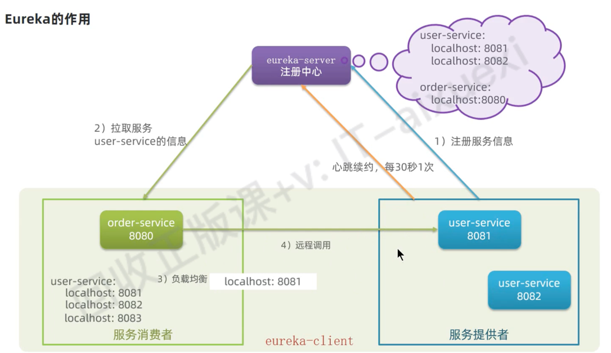
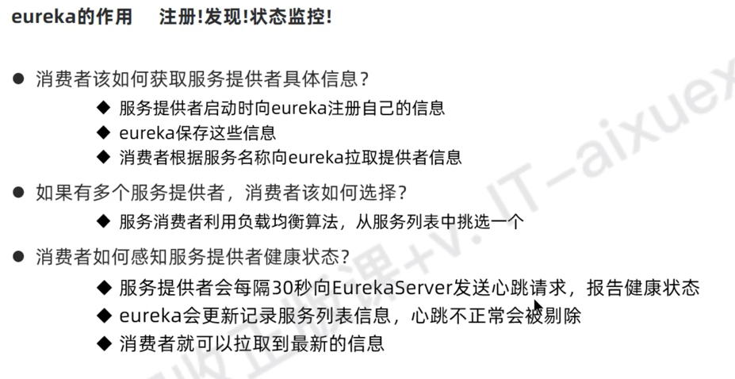
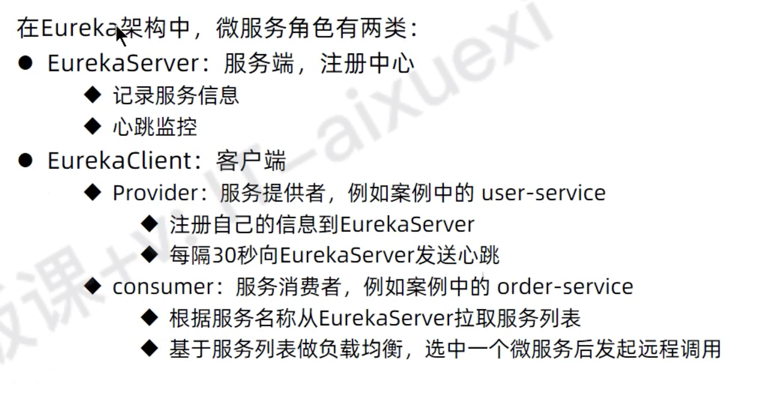
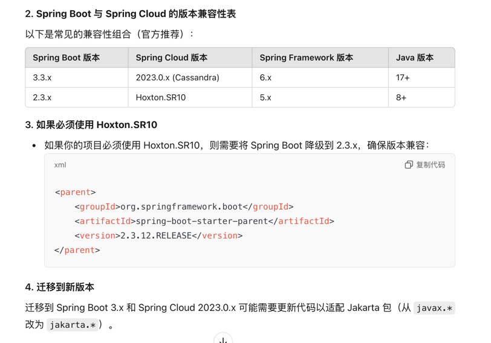
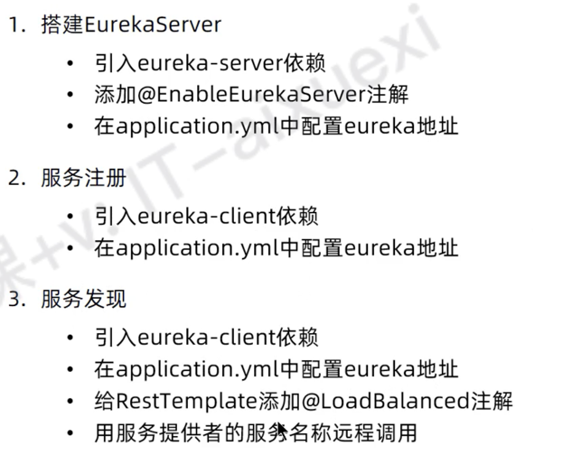

## spring cloud

### 首次学习demo
```xml
<properties>
    <java.version>17</java.version>
    <spring-cloud.version>Hoxton.SR10</spring-cloud.version>
    <mysql.version>8.0.32</mysql.version>
    <mybatis.version>3.0.3</mybatis.version>
</properties>
```

### Eureka 






### 数据库 tb_order
```sql
-- auto-generated definition
create table tb_order
(
    id      bigint auto_increment comment '订单id'
        primary key,
    user_id bigint        not null comment '用户id',
    name    varchar(100)  null comment '商品名称',
    price   bigint        not null comment '商品价格',
    num     int default 0 null comment '商品数量',
    constraint username
        unique (name)
)
    charset = utf8mb3
    row_format = COMPACT;


insert into cloud_order.tb_order (id, user_id, name, price, num) values (101, 1, 'Apple 苹果 iPhone 12 ', 699900, 1);
insert into cloud_order.tb_order (id, user_id, name, price, num) values (102, 2, '雅迪 yadea 新国标电动车', 209900, 1);
insert into cloud_order.tb_order (id, user_id, name, price, num) values (103, 3, '骆驼（CAMEL）休闲运动鞋女', 43900, 1);
insert into cloud_order.tb_order (id, user_id, name, price, num) values (104, 4, '小米10 双模5G 骁龙865', 359900, 1);
insert into cloud_order.tb_order (id, user_id, name, price, num) values (105, 5, 'OPPO Reno3 Pro 双模5G 视频双防抖', 299900, 1);
insert into cloud_order.tb_order (id, user_id, name, price, num) values (106, 6, '美的（Midea) 新能效 冷静星II ', 544900, 1);
insert into cloud_order.tb_order (id, user_id, name, price, num) values (107, 2, '西昊/SIHOO 人体工学电脑椅子', 79900, 1);
insert into cloud_order.tb_order (id, user_id, name, price, num) values (108, 3, '梵班（FAMDBANN）休闲男鞋', 31900, 1);
```

### 数据库 tb_user
```sql
-- auto-generated definition
create table tb_user
(
    id       bigint auto_increment
        primary key,
    username varchar(100) null comment '收件人',
    address  varchar(255) null comment '地址',
    constraint username
        unique (username)
)
    charset = utf8mb3
    row_format = COMPACT;


insert into cloud_user.tb_user (id, username, address) values (1, '柳岩', '湖南省衡阳市');
insert into cloud_user.tb_user (id, username, address) values (2, '文二狗', '陕西省西安市');
insert into cloud_user.tb_user (id, username, address) values (3, '华沉鱼', '湖北省十堰市');
insert into cloud_user.tb_user (id, username, address) values (4, '张必沉', '天津市');
insert into cloud_user.tb_user (id, username, address) values (5, '郑爽爽', '辽宁省沈阳市大东区');
insert into cloud_user.tb_user (id, username, address) values (6, '范兵兵', '山东省青岛市');
```